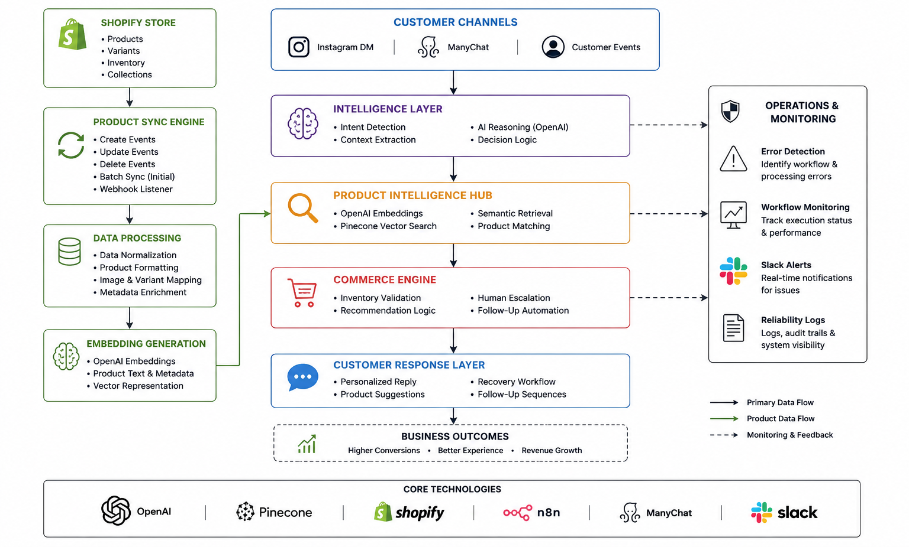

# AI Commerce Intelligence Platform

> AI-powered commerce system that combines conversational intelligence, semantic product search, and real-time inventory awareness to help retail brands convert customer conversations into revenue opportunities.

## What Makes This Different

Most conversational commerce solutions focus on generating replies.

This platform focuses on making decisions.

Instead of acting as a chatbot, it combines AI reasoning, product intelligence, semantic search, and workflow automation to help customers discover relevant products while giving businesses a scalable way to handle conversations.

Key differentiators:

- Semantic product retrieval using vector search
- Real-time synchronization with Shopify inventory
- Inventory-aware recommendations
- Human escalation support
- Automated follow-up workflows
- Modular architecture designed for future expansion

## The Business Problem

Retail brands lose revenue every day due to:

- Slow response times
- Generic product recommendations
- Missed customer inquiries
- Lack of structured follow-up
- Fragmented commerce and communication systems

Traditional chatbots can answer questions.

They rarely understand customer intent, product relevance, or business context.

The result is lower conversion rates and inconsistent customer experiences.
---

## The Solution

The AI Commerce Intelligence Platform introduces an intelligence layer between customer conversations and commerce operations.

The platform:

1. Understands customer intent
2. Retrieves relevant products using semantic search
3. Validates recommendations against live inventory
4. Generates contextual responses
5. Escalates complex situations to human staff
6. Supports automated follow-up workflows

This creates a more intelligent customer experience while reducing operational overhead.

---

## Platform Architecture

The platform is composed of five interconnected layers.

### Customer Layer

- Instagram DM conversations
- ManyChat flows
- Customer interaction events

### Intelligence Layer

- OpenAI reasoning
- Intent classification
- Context extraction
- Decision logic

### Product Intelligence Layer

- Shopify product catalog
- OpenAI embeddings
- Pinecone vector search
- Semantic product retrieval

### Commerce Layer

- Inventory awareness
- Product recommendation logic
- Follow-up triggers
- Conversion workflows

### Operations Layer

- Error monitoring
- Slack notifications
- System visibility
- Reliability controls

---

## Core Components

### VIP Concierge Engine

Handles customer conversations and recommendation workflows.

Responsibilities:

- Intent understanding
- Product discovery
- Response generation
- Human escalation routing

### Product Intelligence Engine

Maintains searchable product intelligence.

Responsibilities:

- Product synchronization
- Embedding generation
- Pinecone indexing
- Inventory updates

### Monitoring Engine

Provides operational visibility.

Responsibilities:

- Error detection
- Workflow monitoring
- Slack alerts
- Reliability management

---

## Key Capabilities

### Conversational Intelligence

- Customer intent understanding
- Context-aware responses
- Personalized recommendations

### Semantic Product Search

- Vector-based retrieval
- Natural language matching
- Product relevance scoring

### Real-Time Commerce Intelligence

- Live inventory awareness
- Product synchronization
- Store data integration

### Revenue Automation

- Follow-up logic
- Opportunity recovery
- Customer re-engagement

### Operational Reliability

- Monitoring workflows
- Error reporting
- Alert management

---

## Demo

See real interaction scenarios:
- `/demo/demo-scenarios.md`

Video walkthrough:
- `/demo/loom-demo-link.txt`

---

## Case Study (Simulation-Based)

This repository includes a boutique-focused use case demonstrating how the system can be applied in a real retail environment.

- `/case-study/boutique-use-case.md`
- `/case-study/expected-impact.md`

---

## Expected Impact

This system is designed to:

- Reduce missed customer opportunities
- Improve response speed and quality
- Increase product discovery relevance
- Enable structured follow-ups
- Enhance overall customer experience

---

## Technical Design Notes

Detailed breakdown of system logic:
- `/technical/ai-decision-logic.md`
- `/technical/stack-overview.md`

Focus areas include:
- Intent classification strategy
- Product matching logic
- Response structuring

---

## Restricted Components

This repository contains a **controlled version** of the system.

Certain production-level components are intentionally excluded:
- Advanced prompt engineering layers
- Full workflow logic
- Secure API configurations
- Optimization strategies

See `/restricted/notes.md` for more details.

---

## Roadmap

This system is designed as a foundation for a broader **Commerce AI infrastructure**.

Planned extensions:

- Multi-channel support (WhatsApp, Web, etc.)
- CRM integration (HubSpot, Airtable, Supabase)
- Customer data intelligence layer
- Brand-specific AI training (voice & tone adaptation)
- Human-in-the-loop moderation systems
- Scalable multi-agent architecture

---

# Positioning

This project represents a shift from traditional automation workflows toward intelligence-driven commerce systems.

Rather than automating individual tasks, the platform focuses on connecting customer conversations, product intelligence, and operational workflows into a unified decision-making system.

The long-term direction is a scalable commerce intelligence infrastructure capable of supporting multiple channels, brands, and AI agents.
---
## Motivation

This system was designed after observing consistent revenue loss patterns in conversational commerce environments, particularly within boutique retail workflows.

The goal was to create a system that does not just respond but understands, decides, and converts.
---

## License

See `LICENSE` for details.

---

## Author

Built by Muhammad Hamid Raza

AI Systems Builder focused on intelligent workflows, retrieval systems, automation architecture, and scalable AI-powered products under XCER Labs.
